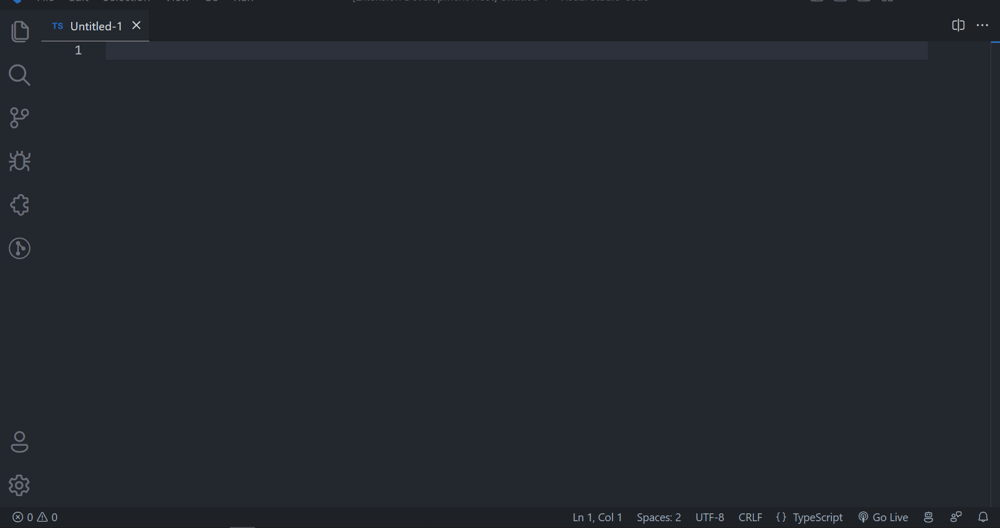
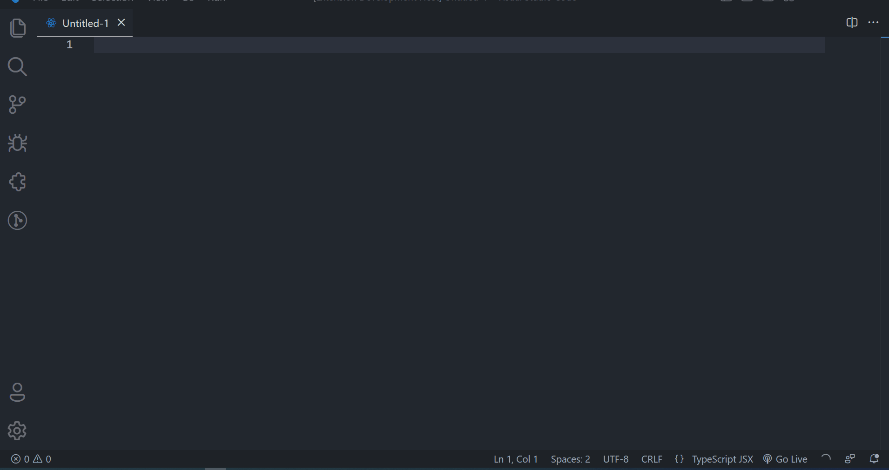
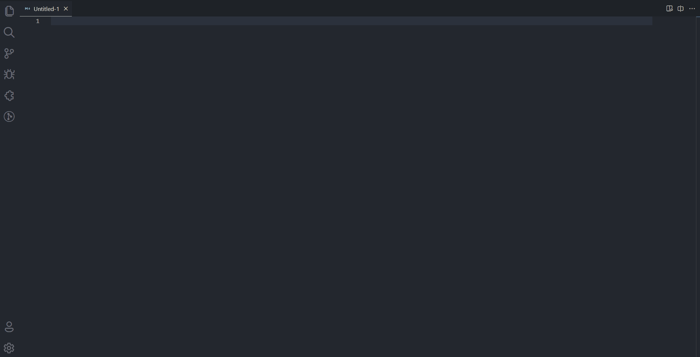
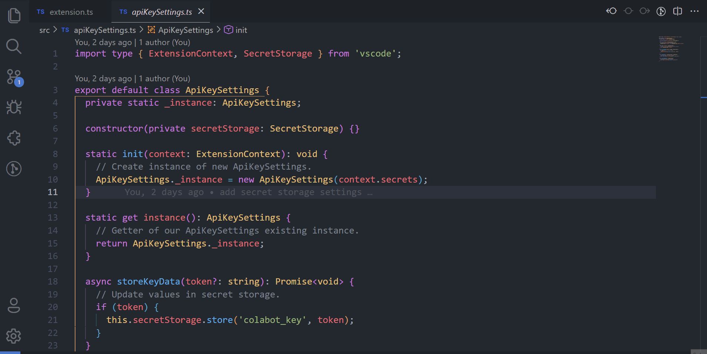

# ColaBOT: AI assistant for VS Code 🤖

**ColaBOT is an AI assistant** for Visual Studio Code that helps you write code faster and more efficiently. With ColaBOT, you can ask questions about your code, get explanations for complex concepts, and generate code snippets based on your input.

## Features

- Ask ColaBOT: Ask ColaBOT questions about your code and get instant answers.
- Explain ColaBOT: Get explanations for complex concepts and programming terms.
- Get Code: Generate code snippets based on your input.
- Set API Key: Set your API key for ColaBOT.
- Remove API Key: Remove your API key for ColaBOT.

## Requirements

- Visual Studio Code version 1.75.0 or higher.

## Installation

1. Open Visual Studio Code.
2. Go to the Extensions view by clicking on the Extensions icon in the Activity Bar on the side of the window or by pressing `Ctrl+Shift+X`.
3. Search for **"ColaBOT"** in the search bar.
4. Click on the "Install" button for the ColaBOT extension.
5. Once the installation is complete, you will be prompted to reload Visual Studio Code.

## Usage

To use ColaBOT, you must first set your API key. To do this, press `Ctrl+Shift+P` to open the Command Palette, and search for "ColaBOT: Set API Key". Then, select your AI provider (OpenAI or Cohere) and enter your API key.

Once your API key is set, you can use the following commands:

## Get Code

- Get Code: Press `Ctrl+Shift+I` to generate code snippets based on your input.
- Keep your cursor at the end of the same comment line.

## Ask Code

- Ask ColaBOT: Press `Ctrl+Shift+P` to open the Command Palette, and search for "ColaBOT: Ask ColaBOT". Then, enter your question and press Enter to get an answer.

## Ask Code Selected

- Ask ColaBOT with code selection: With Right click in your selection you are able to ask something with that selection as context.

## Explain Code

- Explain ColaBOT: With Right click in your selection code or Press `Ctrl+Shift+P` to open the Command Palette, and search for "ColaBOT: Explain ColaBOT". This will return an explanation of what that specific code selection does.

## Configuration

You can configure ColaBOT by going to File > Preferences > Settings, and searching for "ColaBOT". Here, you can set the following options:

- API Key: Set your API key and IA provider for ColaBOT.
- Model: The model to use for ColaBOT.
- Max Tokens: The maximum number of tokens to generate.
- Temperature: The temperature of the model (between 0 and 1).

## License

This extension is licensed under the [MIT License](LICENSE).

## Insipartion

This project was inspired by:

- [Code GPT](https://www.codegpt.co/)

**This README was generated by ColaBOT 🤖**
